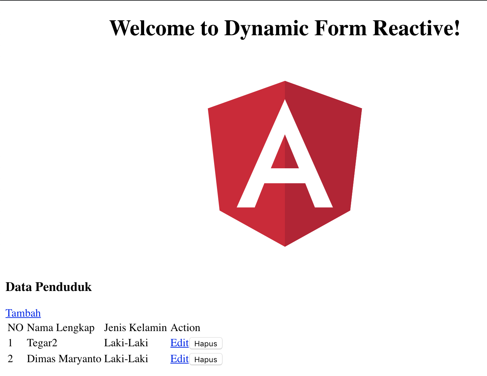
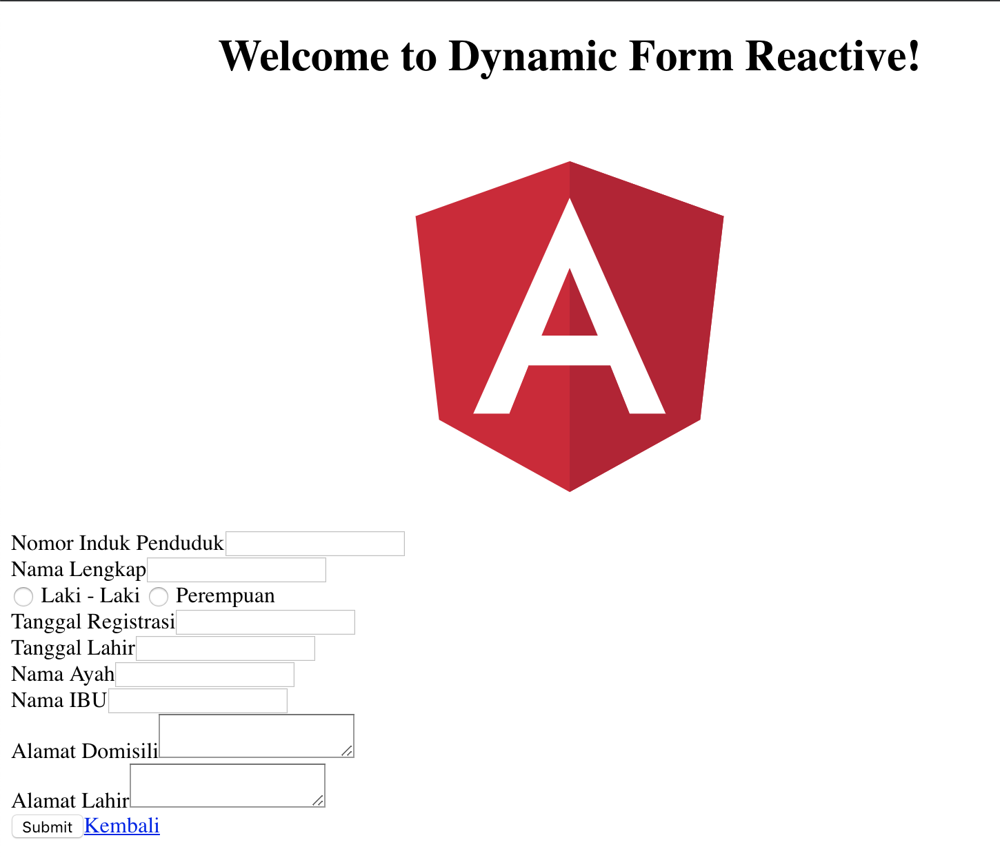
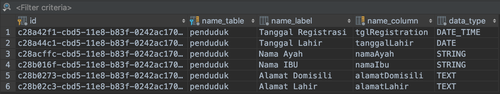

# Dynamic form, fetch from Http json

Template project using angular v6 and springboot 2:

## Springboot

- Hibernate / JPA
- Mysql database

## Angular

- Http Client
- Router
- Form Reactive

## Demo

**List penduduk**

**Form NEW**

**Settings FORMS**

